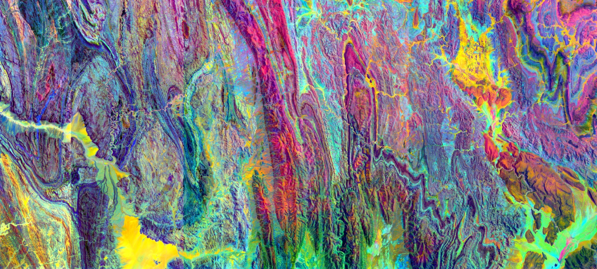

<!-- markdownlint-disable MD041 -->

# Pedro Gonçalves

Researcher in geospatial engineering. Affiliated with **LNEG** (Laboratório Nacional de Energia e Geologia, the Portuguese Geological Survey) since 2013. PhD candidate at **FCUP** (Faculty of Sciences, University of Porto) in Geographic Engineering (geomatics and geoinformatics) since 2025, under an FCT research scholarship.

## About

My work centres on modular geospatial engineering. Since 2013 at LNEG, my role has shifted from operating GIS software to developing my own tools and orchestrating the processing chains that turn raw geospatial data into reproducible scientific outputs. Outputs range from processing toolboxes to standalone applications with their own UIs, with batch pipelines and external integrations in between. Peer-reviewed methodologies are translated into Python implementations and integrated into reproducible, fully automated workflows.

## Doctoral research

Application of Graph Neural Networks to Critical Raw Materials prospectivity mapping in the South Portuguese Zone and Ossa-Morena Zone, integrating Sentinel-2 imagery, hyperspectral data, and prior geological knowledge.

## Research and development at LNEG

In 2025, nine active research and institutional projects covered mineral prospectivity, soil characterisation, surface hydrology and hydrogeology, coastal vulnerability, and geological cartography. Each combines peer-reviewed methods, custom Python toolboxes, Google Earth Engine workflows, and UAV data campaigns.

- **Mineral prospectivity.** Machine learning and deep learning for mineral potential mapping of Portugal's structural units (CRMA, *Plano de Prospeção Nacional*); continental-scale (1:2M) prospectivity for 23 critical, strategic, energy and precious raw materials across Africa, including a synthetic exploration-potential index that combines prospectivity with economic viability criteria (AfricaMaVal).
- **Water and hydrogeology.** C2RCC pipeline for total suspended solids estimation in turbid inland and coastal waters (GSEU); SAR-based water-body extraction with morphological post-processing, multitemporal optical compositing with automated cloud removal and inter-tile colorimetric harmonisation, and optical proxies for dry-season springs (Mozambique Hydrogeological Map update).
- **Soil characterisation.** Multi-sensor fusion of optical (Sentinel-2, Landsat 8/9) and radar (Sentinel-1) data for soil organic carbon estimation, using SAR indices (RVI, RFDI, DpRVI, DPSVI, BMI) and Agrowing multispectral indices (Soil@Int).
- **Coastal vulnerability and climate change.** Contribution to WP5 of the Geological Service for Europe (GSEU) programme.
- **Climate data and reanalysis.** ArcGIS Pro tooling for Copernicus ECDE and ERA5-Land daily reanalysis, supporting climate-impact assessment and regional indicator generation.
- **Geological cartography support.** Band-ratio composites, principal component and minimum noise fraction transforms, and mineralogical indices from Sentinel-2, ASTER and Landsat 9, for institutional geological mapping.

**Tools and pipelines.** Author of MzBM HydroRS (a four-processor toolbox covering Sentinel-1 SAR, Sentinel-2 MSI, Landsat 8/9, and multitemporal mosaicking, built for the Mozambique hydrogeological mapping); the Soil@Int processors; the GSEU TSS pipeline; the Agrowing toolbox for ArcGIS Pro; and the Genesis processor (band ratios, PCA, MNF).

**UAV data acquisition.** Photogrammetric, multispectral, and LiDAR surveys with DJI P1, Agrowing Sextuple, and YellowScan Mapper+ sensors. In 2025, around 23 km² acquired across 12 sites, for abandoned-mine characterisation, agroforestry monitoring, biodiversity reserve mapping, and infrastructure surveys.

**European networks.** Member of the Geological Mapping and Modelling Expert Group (EuroGeoSurveys) and the Copernicus Academy (European Commission / ESA).

## Technical stack

### Earth observation missions

### Reanalysis and climate data

### UAV sensors

### Libraries and platforms

## Selected repositories

- **[sentinel2-tss-pipeline](https://github.com/PedroMMGoncalves/sentinel2-tss-pipeline)**. End-to-end pipeline for Total Suspended Solids estimation in inland and coastal waters from Sentinel-2 MSI, with atmospheric correction and automated quality control. Built for the GSEU programme.
- **[ecde-arcgis-tools](https://github.com/PedroMMGoncalves/ecde-arcgis-tools)**. ArcGIS Pro Python toolbox that converts Copernicus European Climate Data Explorer (HDD/CDD) NetCDF outputs to GeoTIFF and computes multi-model ensemble statistics for climate impact assessment.
- **[era5land-arcgis-tools](https://github.com/PedroMMGoncalves/era5land-arcgis-tools)**. ArcGIS Pro Python toolbox for processing ERA5-Land daily reanalysis NetCDF data into climate indicators and regional time series.
- **[era5land-downloads](https://github.com/PedroMMGoncalves/era5land-downloads)**. Batch downloader for ERA5-Land daily reanalysis data, using DestinE Earth Data Hub as the primary source and the Copernicus Climate Data Store as a fallback.

## Teaching

Trainer for African geological surveys under the EuroGeoSurveys / PanAfGeo programme (PanAfGeo2 and PanAfGeo+), with sessions delivered in São Tomé and Príncipe, Cabo Verde, and Mozambique. Topics include GIS, SAR/InSAR, UAV operations, and hyperspectral data processing. In late 2025, a 50-hour course on *Remote Sensing and Geoprocessing applied to Hydrology* was delivered in Maputo, Mozambique.

## Service

Former board member of APPSIG (Associação Portuguesa de Profissionais de Sistemas de Informação Geográfica), 2016–2024.

## Open to collaboration

Critical raw materials · Geospatial AI · Remote sensing · UAV/LiDAR surveys · Training partnerships

## Links

- Portfolio: [pedrommgoncalves.github.io/pedro_goncalves-portfolio](https://pedrommgoncalves.github.io/pedro_goncalves-portfolio/)
- ORCID: [0000-0002-6556-6086](https://orcid.org/0000-0002-6556-6086)
